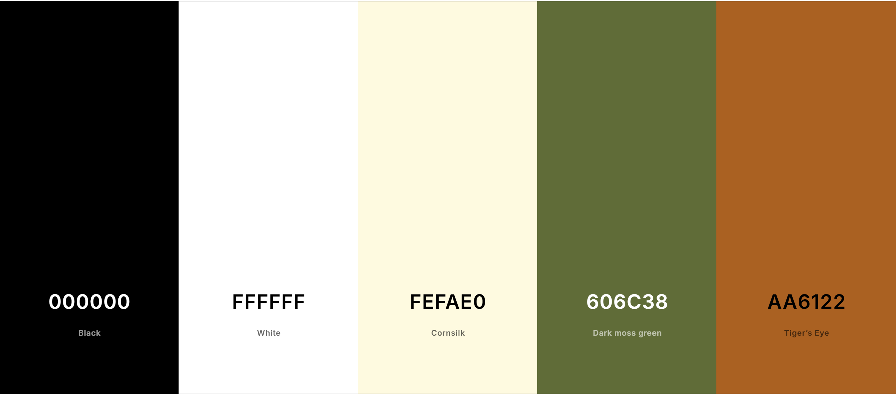
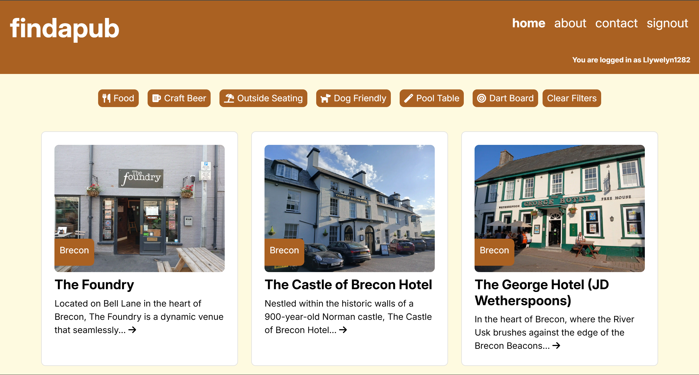
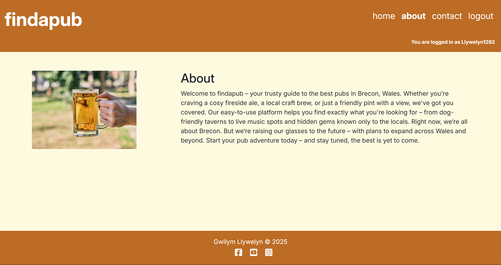
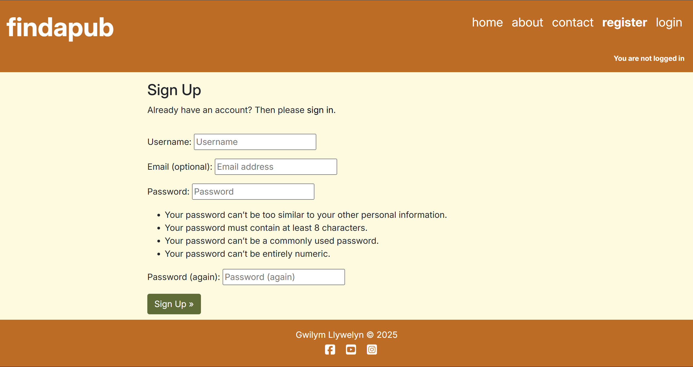
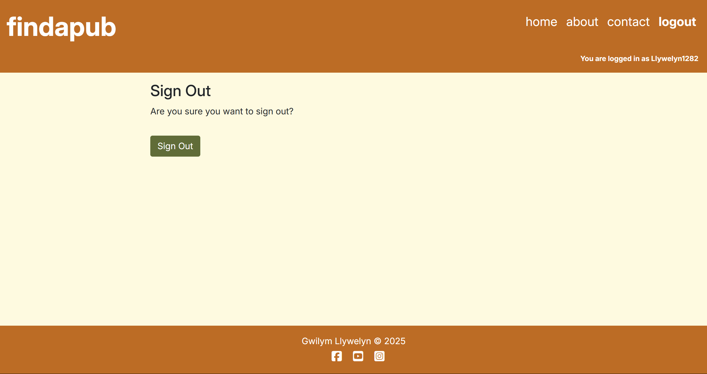

# findapub

findapub was created as my third milestone project for the Code Institutes Level 5 Diploma in Web Application Development. 

Link to Github repository: (https://llywelyn1282.github.io/find-a-pub/)

Link to deployed site on Heroku:

 


- - -

## CONTENTS

* [User Experience](#user-experience)
  * [Project Goals](#project-goals)
  * [Target Audience](#target-audience)
  * [User Stories](#user-story-1)

* [Design](#design)
  * [Colour Scheme](#colour-scheme)
  * [Typography](#typography)
  * [Imagery](#imagery)
  * [Wireframes](#wireframes)

* [Features](#features)
  * [Elements Found on Each Page](#elements-found-on-each-page)
  * [Future Implementations](#future-implementations)

* [Technologies Used](#technologies-used)
  * [Languages Used](#languages-used)
  * [Databases Used](#databases-used)
  * [Frameworks Used](#frameworks-used)
  * [Libraries & Packages Used](#libraries--packages-used)
  * [Programs Used](#programs-used)

* [Testing](#testing)

* [Deployment & Local Development](#deployment--local-development)
  * [Deployment](#deployment)
  * [Local Development](#local-development)
    * [How to Clone](#how-to-clone)
  
* [Credits](#credits)
  * [Code Used](#code-used)
  * [Content](#content)
  * [Media](#media)

- - -

## User Experience

### Project Goals
My project goals are to create a **site where users can locate a pub they wish to visit in the town of Brecon, and find any important information related to that pub**.

### Target Audience
The target audience of the project are **people who like visiting pubs, but either have specific needs, or like to do research about where to go beforehand**.

### User Story 1

As a **new user** I can **create an account easily** so that **I can customise my website experience and be able to leave comments etc.**

#### Acceptance Criteria: 

* Acceptance Criteria 1: With an email a user can register for an account.
* Acceptance Criteria 2: The user can sign in and out easily.
* Acceptance Criteria 3: The user can leave comments.

#### Tasks:

* Task 1: Design and implement a registration form with username, email and password.
* Task 2: Create login and logout functionality.
* Task 3: Allow signed in users to be able to leave comments.


### User Story 2

As an **admin** I can **create pub entries** so that **information can be displayed for users to consume**.

#### Acceptance Criteria: 

* Acceptance Criteria 1: The admin can create a pub entry.
* Acceptance Criteria 2: The site displays these entries clearly and presentably.

#### Tasks:

* Task 1: Build an interface to add important information regarding each pub.
* Task 2: Save entries to a database.
* Task 3: Make sure entries are displayed clearly on the site.


### User Story 3

As an **admin** I can **manage pub entries** so that **data can be edited and added to with ease**.

#### Acceptance Criteria: 

* Acceptance Criteria 1: An admin can easily create entries.
* Acceptance Criteria 2: An admin can easily view entries.
* Acceptance Criteria 3: An admin can easily edit entries.
* Acceptance Criteria 4: An admin can easily delete entries.


#### Tasks:

* Task 1: Create an admin interface listing all pub entries.
* Task 2: Ensure the interface includes edit and delete functionality for the entries.


### User Story 4

As a **user** I can **view a list of pub entries easily** so that **I can see which pub best suits my needs**.

#### Acceptance Criteria: 

* Acceptance Criteria 1: A paginated list of pubs is show on the site homepage.
* Acceptance Criteria 2: The pub entries are written clearly and concisely.
* Acceptance Criteria 3: The pub entries are presented in an aesthetically pleasing manner.

#### Tasks:

* Task 1: Design a homepage layout with pagination of entry thumbnails.
* Task 2: The user is able to click each thumbnail to reveal the full entry.


### User Story 5

As a **user** I can **filter the list of pub entries by set criteria** so that **I can easily manipulate the information to see what best suits my needs**.

#### Acceptance Criteria: 

* Acceptance Criteria 1: Users can filter pubs by set criteria.
* Acceptance Criteria 2: Users can combine multiple filters at once.

#### Tasks:

* Task 1: Add filter elements to the UI.
* Task 2: Implement query logic to filter pub entries.
* Task 3: Update list as filters are applied.


### User Story 6

As a **user** I can **create a favourites list of pubs on the site** so that **I can revisit places I have found later**.

#### Acceptance Criteria: 

* Acceptance Criteria 1: Users who are logged in can favourite a pub.
* Acceptance Criteria 2: The favourites are stored on a profile for the user.
* Acceptance Criteria 3: The user can view and manage these favourites easily.

#### Tasks:

* Task 1: Add a favourite button to each entry.
* Task 2: Store favourites in a user profile in the database.
* Task 3: Create a favourites page for users to view and edit their favourited entries.


### User Story 7

As an **admin** I can **create draft entries** so that **I can finish them at a later date**.

#### Acceptance Criteria: 

* Acceptance Criteria 1: An entry can be saved as a draft instead of published immediately.
* Acceptance Criteria 2: The draft can be accessed at a later date to continue creation.

#### Tasks:

* Task 1: Add a 'Save as Draft' option to the pub entry interface.
* Task 2: Mark these entries as drafts when displayed on the admin page.
* Task 3: Allow for continued editing of these entries and the option to then publish them.


### User Story 8

As a **user** I can **easily leave and view comments/reviews** so that **I can view the opinions of others while making a choice of which pub to visit**.

#### Acceptance Criteria: 

* Acceptance Criteria 1: Users can submit a comment or review on a pub’s detail page.
* Acceptance Criteria 2: Submitted comments displayed under the pub entry.
* Acceptance Criteria 3: Comments for a pub are shown in chronological order (newest first), showing the timestamp and commenter name. 

#### Tasks:

* Task 1: Implement a comment form for each entry page.
* Task 2: Comments are displayed under each entry.
* Task 3: Comments are displayed in chronological order.

### User Story 9

As an **admin** I can **approve or deny comments/reviews** so that **I can retain a positive, clean and productive discourse on the site**.

#### Acceptance Criteria: 

* Acceptance Criteria 1: The admin can approve comments.
* Acceptance Criteria 2: The admin can disapprove comments.

#### Tasks:

* Task 1: Add approval queue for comments.
* Task 2: Add approval or deny buttons for each comment.
* Task 3: Display only approved comments on the site.

### User Story 10

As a **user** I can **edit or delete comments/reviews** so that **I can change typos etc. or delete the comment alltogether if I change my mind**.

#### Acceptance Criteria: 

* Acceptance Criteria 1: The logged in user can edit their comments.
* Acceptance Criteria 2: The logged in user can delete their comments.

#### Tasks:

* Task 1: Add and edit and delete button to users comments.

### User Story 11

As a **user** I can **visit an About and Contact page with a form** so that **I can learn about the site's goals and contact the creators in regard to any neccesary queries**.

#### Acceptance Criteria: 

* Acceptance Criteria 1: There is an about page with information about the site and what it offers.
* Acceptance Criteria 2: The page also features a contact section with a form.
* Acceptance Criteria 3: The user is able to easily find this within the UI and it looks aesthetically pleasing.

#### Tasks:

* Task 1: Create an informative about page.
* Task 2: Implement a contact form that submits to an email service.


- - -

## Design

### Colour Scheme



### Typography

I used Google Fonts to import the following fonts for use in the site:

##### Logo & Headings 

[**Inter**](https://fonts.google.com/specimen/Inter)


##### Paragraphs 

[**Inter**](https://fonts.google.com/specimen/Inter)


##### Icons 

Icons were used from [Font Awesome](https://fontawesome.com/icons)

### Imagery

Favicon generated using [favicon.io](https://favicon.io/) 


### Wireframes

Wireframes were created for mobile and desktop using Balsamiq.

Home Page


Contact Page


- - -

### Database Schema & User Journey

#### __User Journey__


#### __Database Plan__

| Key | Name | Type |
| --- | --- | --- |
| `Pubs` |
|  | Pub Name(unique) | CharField |
|  | Address | TextField |
|  | Opening Hours | TextInput |
|  | Price | CharField |
|  | Craft Beer | BooleanField |
|  | Dog Friendly | BooleanField |
|  | Pool Table | BooleanField |
|  | Dart Board | BooleanField |
|  | Description | TextField |
|  | Author | User Model |
| `User` |
|  | Username(unique) | CharField |
|  | Name | CharField | 
|  | Password | CharField |

- - -


## Features

The website is comprised of **7** pages:

* Home Page
* Pub Detail Pages
* About Page
* Contact Page
* Register Page
* Sign In Page
* Sign Out Page

### Site Wide

__Navbar__
  
* Navbar styled to have right sided margin and burger icon on smaller devices. Contains links to **Home Page**, **About Page**, **Contact Page**, **Register Page** and **Sign In Page** if you aren't signed in, and **Sign Out Page** if you are signed in.
  
  

__Footer__

* Footer containing social media links is displayed on all pages of the website. 

  

### Home Page

* **add info here**.



### About Page

* **add info here**.



### Contact Page

* **add info here**.


### Register Page

* **add info here**.



### Sign In Page

* **add info here**.


### Sign Out Page

* **add info here**.



### 404 Error Page

* A 404 page is in place to display if a user navigates to a broken link. The page has a link that allows users to navigate back to the homepage.


### Future Implementations

In future implementations I would like to:

* **add info here**
* **add info here**
* **add info here**

- - -


## Technologies Used

### Languages Used

HTML, CSS, JavaScript, Python

### Databases Used

[PostgreSQL](https://www.postgresql.org/) 

### Frameworks Used

[Django](https://www.djangoproject.com/)

### Programs Used

[Balsamiq](https://balsamiq.com/) - Used to create wireframes.

[Github](https://github.com/) - To save and store the files for the website.

[Google Fonts](https://fonts.google.com/) - To import the fonts used on the website.

[Favicon.io](https://favicon.io/favicon-converter/) - To create the favicon files.

[Font Awesome](https://fontawesome.com/)  - For the icons on the website.

[Google Chrome Dev Tools](https://developer.chrome.com/docs/devtools/) - To troubleshoot and test features, solve issues with responsiveness and styling.

[Am I Responsive?](http://ami.responsivedesign.is/) - To show the website image on a range of devices.


- - -

## Testing

Testing is listed in a separate file which can be found here: [TESTING.md](TESTING.md)


- - -

## Deployment & Local Development

The following git commands were used throughout development to push code to the remote repo:

```git add <file>``` - This command was used to add the file(s) to the staging area before they are committed.

```git commit -m “commit message”``` - This command was used to commit changes to the local repository queue ready for the final step.

```git push``` - This command was used to push all committed code to the remote repository on github.

### Deployment

The site was deployed to Heroku. The steps to deploy are as follows: 

The live link can be found here - (**add info here**)

#### How to Clone

Navigate to the GitHub Repository you want to clone to use locally:

- Click on the code drop down button
- Click on HTTPS
- Copy the repository link to the clipboard
- Open your IDE of choice (git must be installed for the next steps)
- Type git clone copied-git-url into the IDE terminal

The project will now of been cloned on your local machine for use.


- - -


## Credits

**add info here**

### Content

Content for this project was written by Gwilym Llywelyn.

### Media

**add info here**