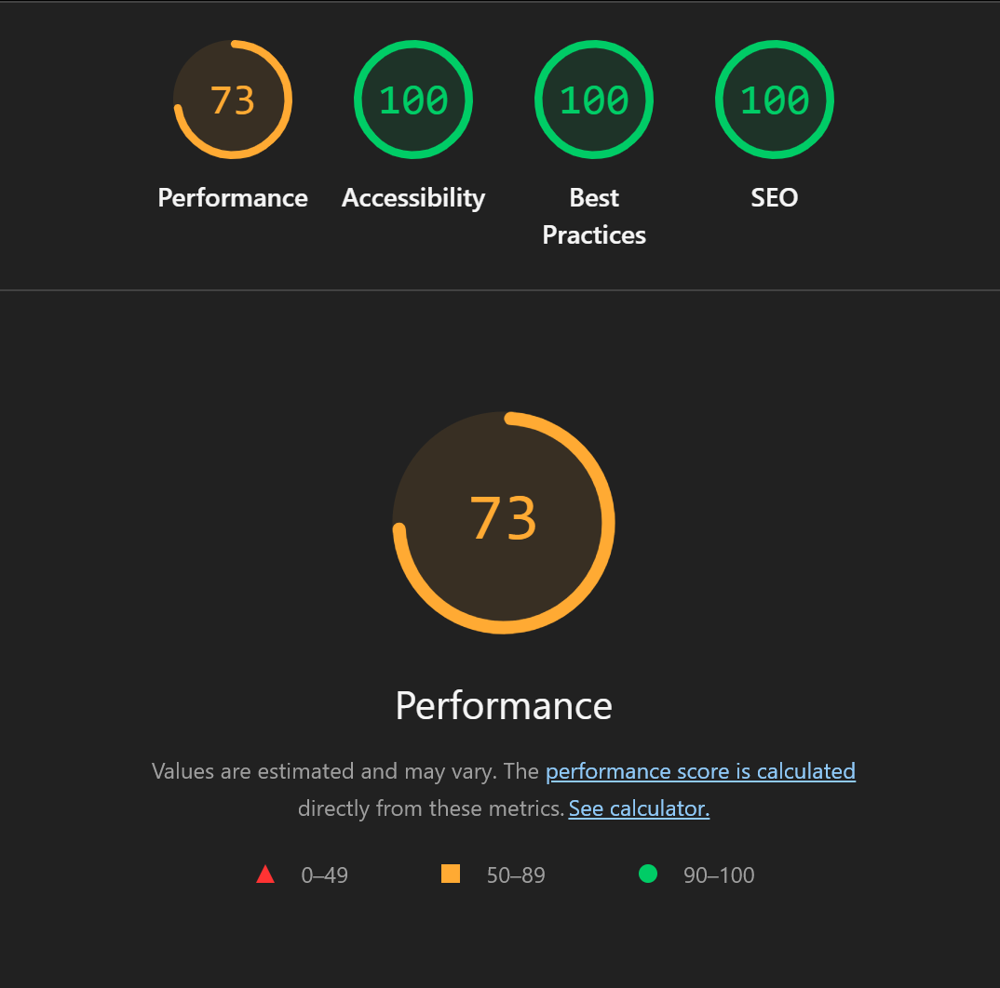
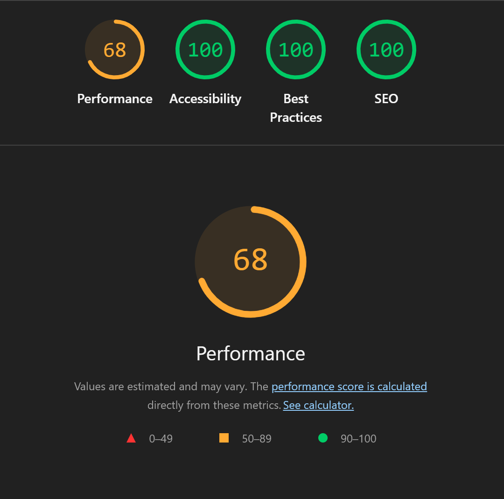
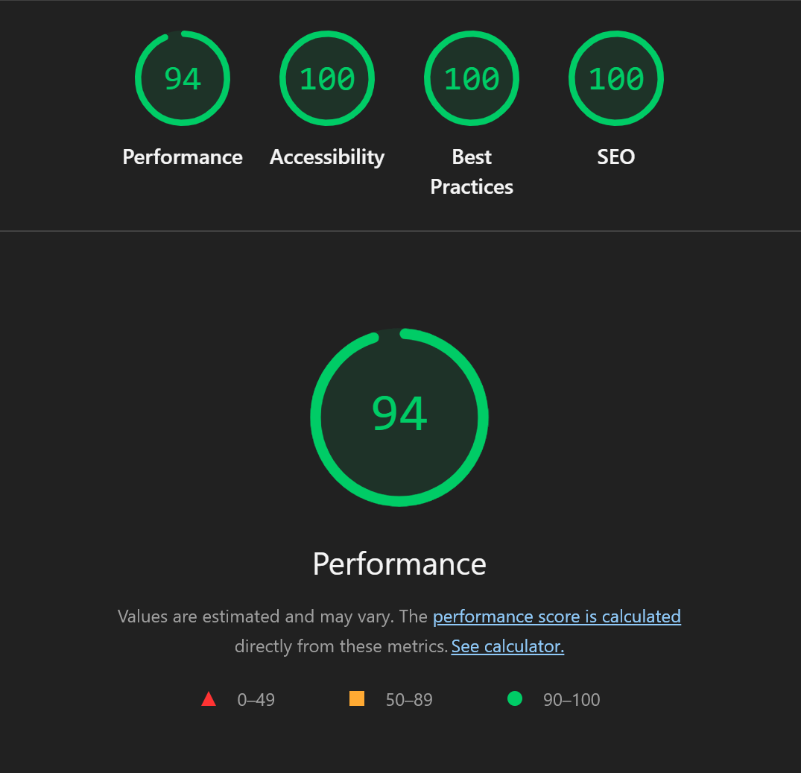
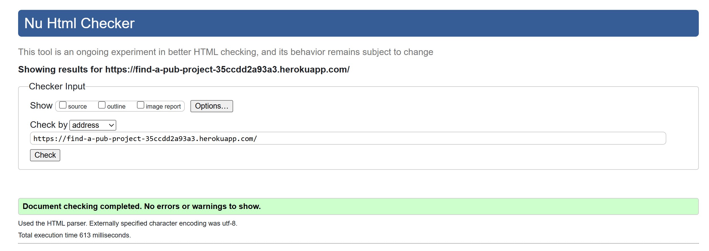
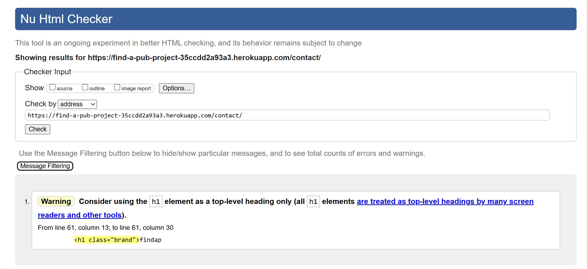
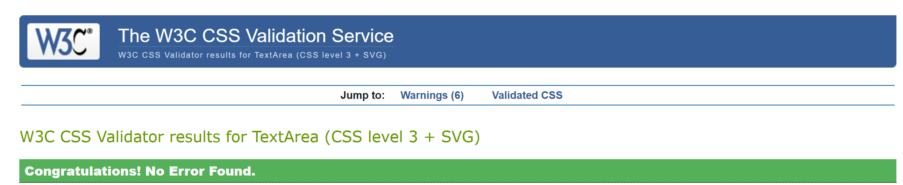

## Testing

### Responsiveness

All pages were tested to ensure responsiveness on screen sizes from 320px and upwards as defined in [WCAG 2.1 Reflow criteria for responsive design](https://www.w3.org/WAI/WCAG21/Understanding/reflow.html) on Chrome, Edge, Firefox and Opera browsers.

Steps to test:

1. Open browser and navigate to [findapub](https://find-a-pub-project-35ccdd2a93a3.herokuapp.com)
2. Open the developer tools (right click and inspect)
3. Set to responsive and decrease width to 320px
4. Set the zoom to 50%
5. Click and drag the responsive window to maximum width

Expected:

Website is responsive on all screen sizes and no images are pixelated or stretched.
No horizontal scroll is present.
No elements overlap.

Actual:

Website behaved as expected.

Website was also opened on the following devices and no responsive issues were seen:

- Samsung A15
- iPad Pro
- Lenovo Ideapad S540

### Accessibility

Wave Accessibility tool was used throughout development and for final testing of the deployed website to check for any aid accessibility testing.

Testing was focused to ensure the following criteria were met:

- All forms have associated labels or aria-labels so that this is read out on a screen reader to users who tab to form inputs
- Color contrasts meet a minimum ratio as specified in WCAG 2.1 Contrast Guidelines
- Heading levels are not missed or skipped to ensure the importance of content is relayed correctly to the end user
- All content is contained within landmarks to ensure ease of use for assistive technology, allowing the user to navigate by page regions
- All not textual content had alternative text or titles so descriptions are read out to screen readers
- HTML page lang attribute has been set
- Aria properties have been implemented correctly
- WCAG 2.1 Coding best practices being followed
- Manual tests were also performed to ensure the website was accessible as possible and an accessibility issue was identified.

### Lighthouse Testing

#### __Home Page__

#### __About Page__

#### __Contact Page__

#### __Contact Page__

#### __404 Page__

### Testing User Stories

| Goals                 | How are they achieved? |
| --------------------- | ---------------------- | 

### Functional Testing

| Feature | Expected Outcome | Testing Performed | Result | Pass/Fail |
|---------|------------------|-------------------|--------|-----------|
| `Navbar` | | | | |
| Home Page Nav Link | Home Page Loads | Clicked on Link | Taken to Page | Pass |
| About Page Nav Link | About Page Loads | Clicked on Link | Taken to Page | Pass |
| Contact Page Nav Link | Contact Page Loads | Clicked on Link | Taken to Page | Pass |
| Sign Up Page Nav Link | Sign Up Page Loads | Clicked on Link | Taken to Page | Pass |
| Sign In Page Nav Link | Sign In Page Loads | Clicked on Link | Taken to Page | Pass |
| Sign Out Page Nav Link | Sign Out Page Loads | Clicked on Link | Taken to Page | Pass |
| `Footer` | | | | |
| Facebook Link | Opens Facebook in New Tab | Clicked on Link | Opens Facebook in New Tab | Pass |
| YouTube Link | Opens YouTube in New Tab | Clicked on Link | Opens YouTube in New Tab | Pass |
| Instagram Link | Opens Instagram in New Tab | Clicked on Link | Opens Instagram in New Tab | Pass |
| `Home Page` | | | | |
| Filter | - | Clicked on Button | - | Pass |
| Pub Detail Link | - | Clicked on Button | - | Pass |
| `Pub Detail Page` | | | | |
| Comment Add | - | Clicked on Button | - | Pass |
| Comment Edit | - | Clicked on Button | - | Pass |
| Comment Delete | - | Clicked on Button | - | Pass |
| `Contact Page` | | | | |
| Send Button | Sends Form To Backend Admin Section and Gives Succes Message | Clicked on Button | Sends Form To Backend Admin Section and Gives Succes Message | Pass |
| `404 Page` | | | | |
| Back to Homepage Link | Takes User Back to Home Page | Clicked on Link | Takes User Back to Home Page | Pass |

### Validator Testing 

HTML
  - No errors were returned when passing through the official [W3C Validator](https://validator.w3.org)

  

  

  

CSS
  - No errors were found when passing through the official [Jigsaw Validator](https://jigsaw.w3.org)
  
  

JavaScript
 - No errors were found when passing through the official [JSHint Validator](https://www.jshint.com/)
  
  

Python
- No errors were found when passing through the Code Institute Python Linter [Python Validator](https://pep8ci.herokuapp.com/)

### Fixed Bugs

| Bug | Solution |
|------|-----------|
| .phone_number was not appearing in database and throwing errors | After many attempts the fix was deleting the migrations, caches and database data and starting again |
| Persisting overflow issue on certain pages | After many attempts at locating and fixing the cause, the issue was found to be simply that certain rows were not contained within containers, thus breaking the bootstrap structure and causing overflow. |
| Favicon not showing on all pages apart from home page | Changed href to href="" etc. |
| Had trouble targeting active page in navbar | First issue: Changed to  instead of 
Second issue: Changed name to the correct "Pubs" instead of "home" |
| Unable to target socials using CSS | Was using "a .socials {}" instead of ".socials a {}" |

### Unfixed Bugs

* No known bugs.